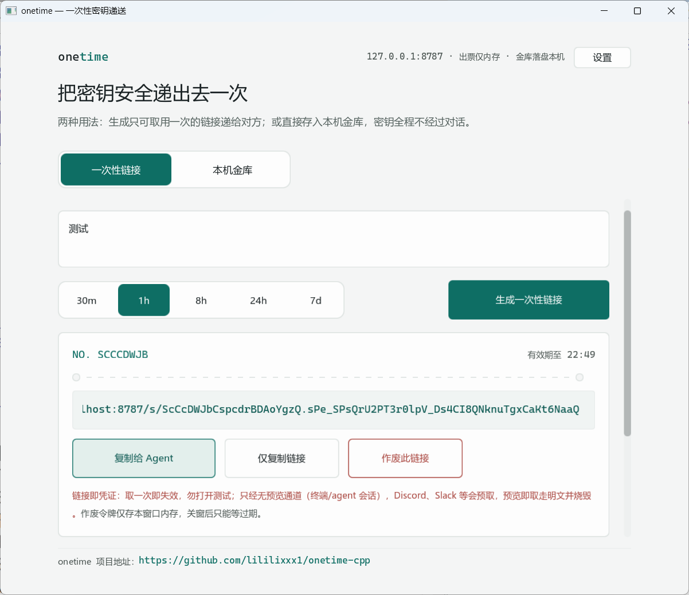

# onetime-cpp


一次性密钥递送的原生 C++ 桌面应用：票据式 GUI（[EUI-NEO](https://github.com/sudoevolve/EUI-NEO)）+ 内置本机 HTTP 服务 + AES-256-GCM 加密金库。不引入第三方密码库（Windows 走系统 CNG，Linux 自带实现）；Windows Release 为静态 CRT 单文件 exe，目标机零依赖。

> **链接即凭证**：取走一次即烧毁，请勿打开测试。只经无预览的通道递送（直接贴进终端 / agent 会话）；Discord、Slack 等会预取链接的 IM 会在预览时就取走明文并烧毁链接。

## 特性

- **一次性链接**：明文只存进程内存，`GET /s/<id>.<key>` 取走即焚；TTL 30 秒 ~ 168 小时（默认 1h），支持作废（作废令牌仅存当前窗口内存）。
- **本机金库**：常用密钥 AES-256-GCM 加密落盘（`~/.onetime/secrets`），条目名可记忆、内容加密，一键出票。
- **设置中心**：监听地址、公网基址、默认 TTL、金库目录、主题、托盘、开机自启等，保存即时生效（个别项重启生效）。
- **零泄漏日志**：只记事件与字节数，不落路径、链接、ID、密钥与内容。
- **单文件分发**：MSVC 静态 CRT（/MT）+ LTCG，一个 exe 即整个应用。

## 界面

启动后是本机窗口程序（HTTP 服务内置于同进程）：



| 页签 | 内容 |
| --- | --- |
| 一次性链接 | 粘贴密钥 → 选 TTL → 生成；票据含编号 / 过期时间 / 链接，支持「复制给 Agent」（按模板替换）、仅复制链接、作废 |
| 本机金库 | 加密条目列表，取用 / 追加 / 删除；条目名明文便于查找，内容加密存储 |
| 设置 | 服务参数与外观行为，`~/.onetime/settings.txt` 落盘 |

## HTTP API

默认监听 `127.0.0.1:8787`（仅本机）。跨站浏览器请求被 CSRF 防护拒绝，终端 / agent 直连不受影响：

```bash
# 生成一次性链接（body 即明文，最大 1 MiB；ttl 可选 30s ~ 168h，如 5m/1h/1d）
curl -s -X POST --data-binary 'API_KEY_xxx' 'http://127.0.0.1:8787/create?ttl=1h'
# → http://127.0.0.1:8787/s/<id>.<key>

# 取走（一次即焚，再取 404/410）
curl -s 'http://127.0.0.1:8787/s/<id>.<key>'

# 作废（需作废令牌）
curl -s -X DELETE -H 'X-Delete-Token: <token>' 'http://127.0.0.1:8787/s/<id>.<key>'

# 金库：GET | POST | DELETE /vault
curl -s 'http://127.0.0.1:8787/vault'
```

## 从源码构建

依赖：CMake ≥ 3.20，VS 2022 Build Tools（C++ 工作负载）或 GCC/Clang。GUI 框架 EUI-NEO 不含在本仓库内，先取一份放进 `3rd/`（bundled 模式，其余依赖全离线）：

```bash
git clone https://github.com/lililixxx1/onetime-cpp.git
cd onetime-cpp
git clone https://github.com/sudoevolve/EUI-NEO.git 3rd/EUI-NEO
```

**Windows**（配置 + Release 构建 + 跑测试一步完成）：

```bat
build.bat
```

或手动：

```bash
cmake -S . -B build
cmake --build build --config Release
build\Release\onetime.exe            # 应用
build\Release\onetime_tests.exe      # 测试（154 项安全不变量）
```

**Linux**：见 [docs/linux-build.md](docs/linux-build.md)（托盘依赖 glib/gio 或 GTK，缺失时以 `-DEUI_ENABLE_TRAY=OFF` 关闭）。

## 命令行与配置

| 参数 | 默认 | 说明 |
| --- | --- | --- |
| `-addr host:port` | `127.0.0.1:8787` | 监听地址 |
| `-base url` | 按请求 Host 推导 | 生成链接的对外基址（反向代理场景） |
| `-ttl dur` | `1h` | 默认存活期，`30s` ~ `168h` |
| `-vault dir` | `~/.onetime/secrets` | 金库目录 |

优先级：命令行显式参数 > `~/.onetime/settings.txt` > 默认值。设置文件为 `key=value` 纯文本（由设置中心自动维护）：`default_ttl`（30m/1h/8h/24h/7d）、`public_base`、`listen_addr`、`vault_dir`、`auto_copy_link`、`clear_name_after_put`、`show_records`、`theme`（light/dark）、`ui_scale`、`autostart`、`minimize_to_tray`、`log_to_file`。

## 安全模型

- **票据仅内存**：明文密钥只存在于进程内存，取走 / 过期 / 重启即消失；作废令牌同样只在本窗口生命周期内有效。
- **金库加密落盘**：AES-256-GCM（12 字节 nonce + 16 字节 tag），密文布局 nonce ‖ 密文 ‖ tag；Windows 与 Linux 构建由共享测试向量锁定逐字节一致，金库文件跨平台通用。
- **OS 原语密码学**：Windows 走 CNG（`BCryptGenRandom` 系统熵源、SHA-256、AES-GCM），POSIX 侧等价实现；不引入第三方密码库。
- **CSRF 防护**：`Sec-Fetch-Site` / `Origin` 校验，浏览器跨站请求拒绝，防恶意页面借本机服务出票。
- **日志零泄漏**：事件与字节数之外不落任何敏感字段。

## 文档

- [docs/settings-design.md](docs/settings-design.md) — 设置中心设计
- [docs/linux-design.md](docs/linux-design.md) — Linux 版设计（跨平台方案）
- [docs/linux-build.md](docs/linux-build.md) — Linux 构建指南
- [docs/性能优化方案.md](docs/性能优化方案.md) — 性能优化记录

## 许可证

本项目代码以 [GPL-3.0](LICENSE) 发布。GUI 框架 [EUI-NEO](https://github.com/sudoevolve/EUI-NEO)（Apache-2.0）为独立仓库、独立许可，需自行获取。
